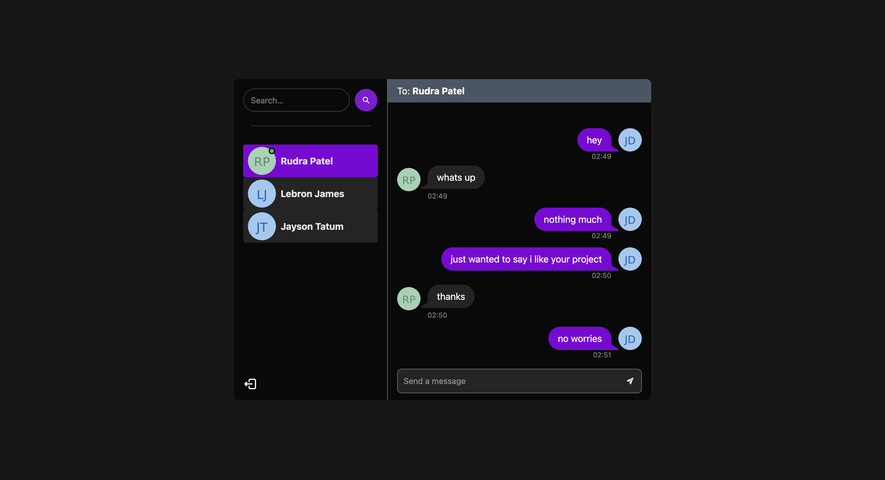

# Chat App

## Description  
This is a chat application built using MongoDB, Express.js, React, Node.js and Socket.io. Users can create accounts, login and message others in real time. The frontend is styled using Tailwind CSS and DaisyUI.

---

## Image  

---

## Features
 - **User Authentication**: Sign up and log in using **JWT** for authentication.
 - **Real-Time Messaging**: Send and receive messages in real-time.
 - **User Search**: Search for users and message them directly.
 - **Online Status**: See which users are currently online.
 - **Responsive UI**: The app is fully responsive, designed with Tailwind CSS and enhanced with DaisyUI components.

## Tech Stack
 - **Backend**: Node.js, Express.js
 - **Database**: MongoDB
 - **Frontend**: React.js, Tailwind CSS, DaisyUI
 - **Real-Time Communication**: Socket.io
 - **Authentication**: JWT (JSON Web Tokens)
